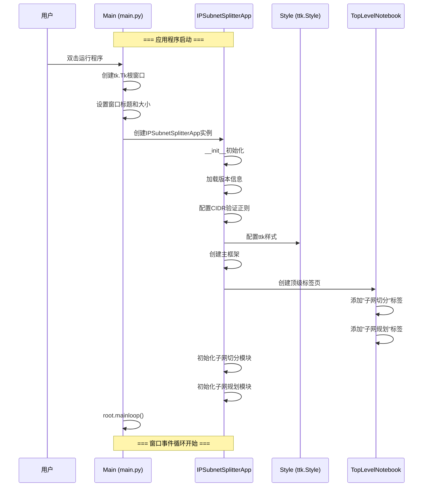
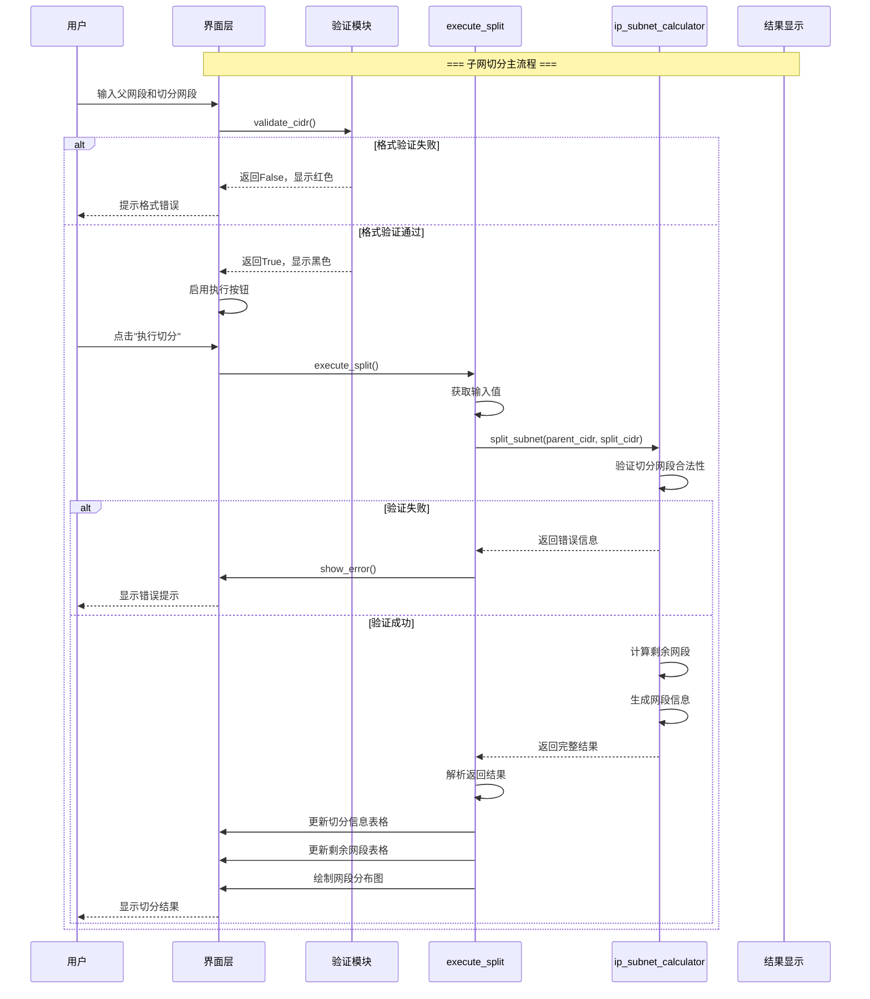
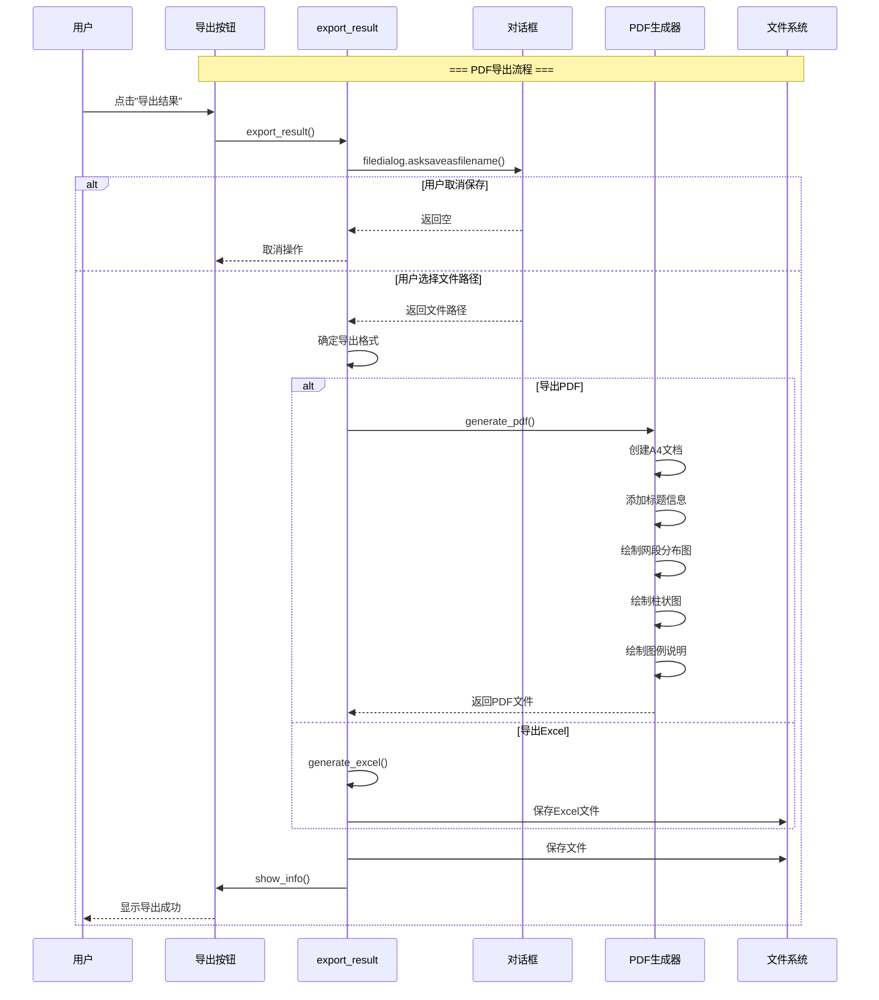
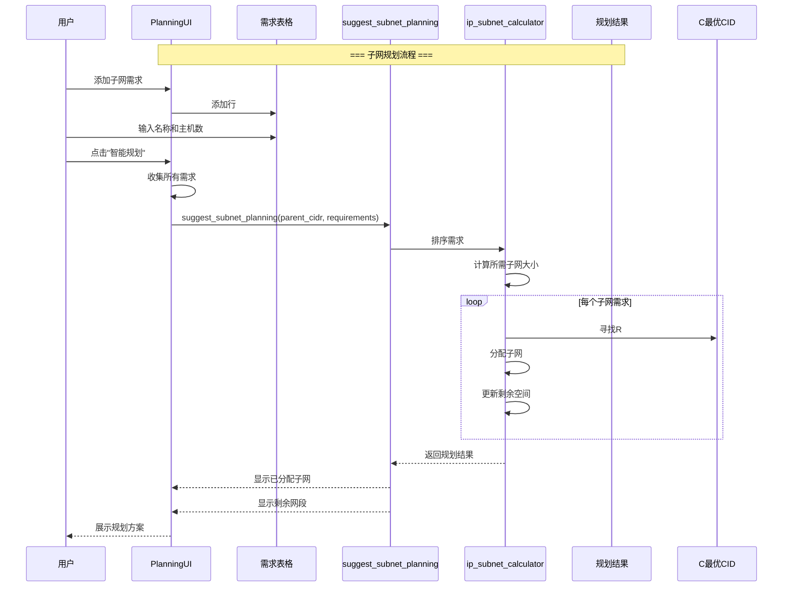
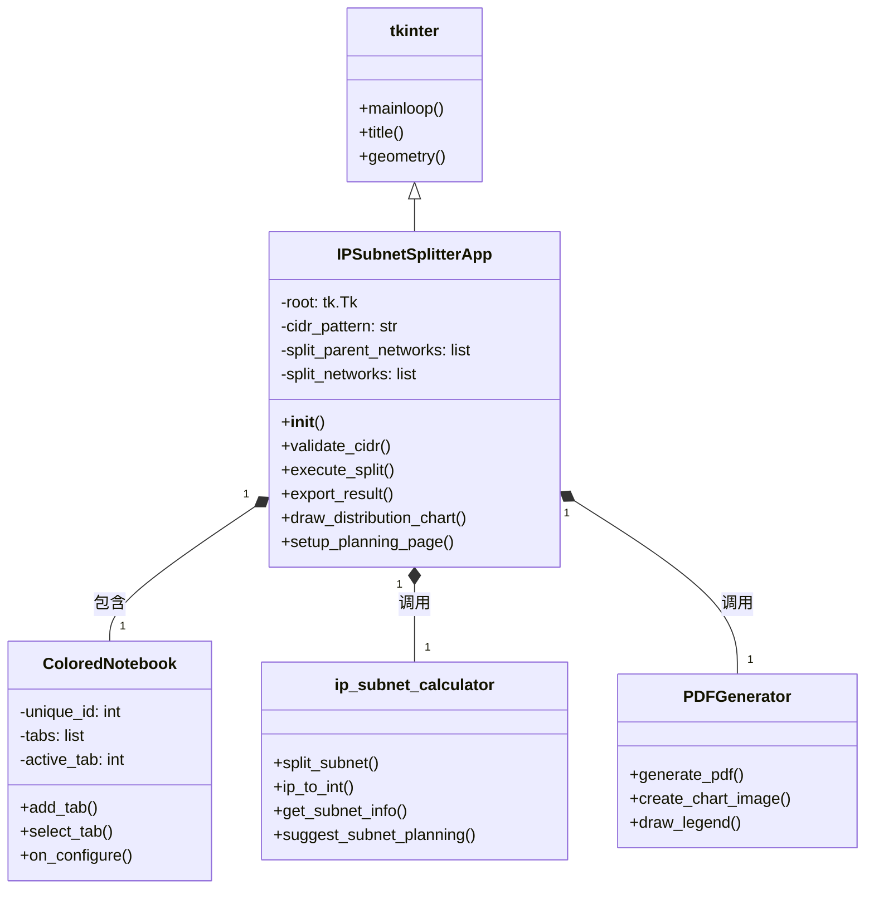
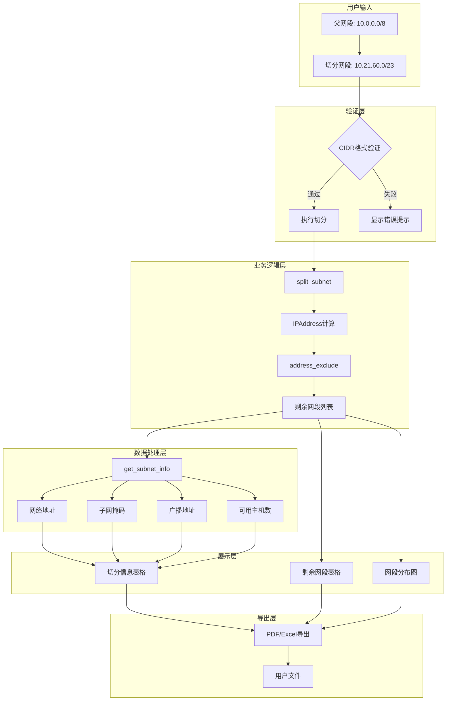
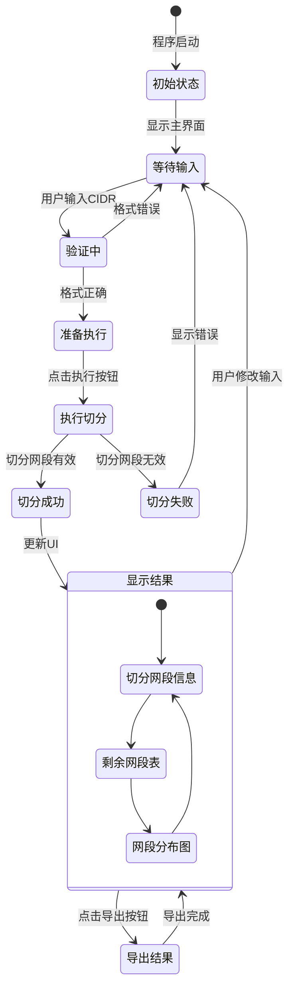
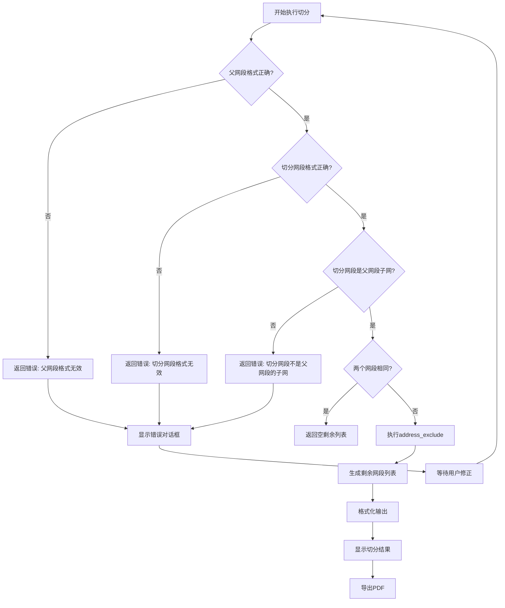
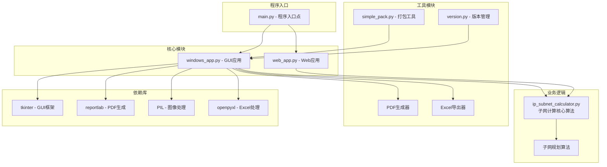

# 子网规划师 - 代码流程图

## 1. 应用程序启动流程

## 2. 子网切分核心流程

## 3. PDF导出流程

## 4. 网段分布图绘制流程

```mermaid
sequenceDiagram
    participant E as execute_split
    participant G as 图表生成器
    participant C as Canvas
    participant I as Image (PIL)
    participant F as Font
    
    Note over E,F: === 图表绘制流程 ===
    E->>G: draw_distribution_chart()
    G->>G: 获取切分数据
    G->>G: 计算图表尺寸
    G->>G: 确定画布高度
    
    rect rgb(40, 40, 40)
    Note over G,F: === 图像生成阶段 ===
    G->>I: 创建Image对象
    I->>F: 加载字体
    F-->>I: 返回字体对象
    I->>I: 绘制背景
    I->>I: 绘制标题
    I->>I: 绘制网格线
    I->>I: 绘制柱状图
    I->>I: 绘制数值标签
    I->>I: 绘制图例说明
    end
    
    G->>I: 转换为PhotoImage
    I-->>G: 返回图像对象
    G->>C: create_image()
    C->>C: 在Canvas上显示
    G->>C: 绑定滚动事件
    C-->>E: 完成绘制
```

## 5. 子网规划流程

## 6. 核心类关系图

## 7. 数据流向图

## 8. 状态转换图

## 9. 错误处理流程

## 10. 文件模块依赖关系

这个流程图完整展示了子网规划师的：
- 程序启动流程
- 核心业务逻辑（子网切分、子网规划）
- 用户交互流程
- 数据处理和展示流程
- 错误处理机制
- 模块依赖关系

所有流程图都遵循标准符号规范，使用Mermaid语法编写，可以直接在支持Mermaid的文档工具中渲染显示。
